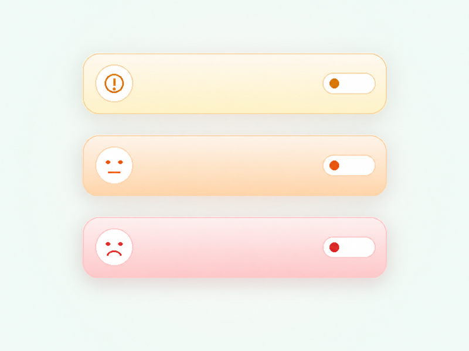
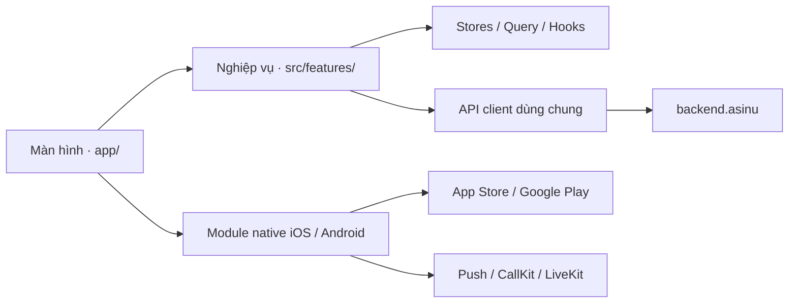

<div align="center">
  

  <h1>Asinu</h1>

  <p><strong>Sức khỏe của bạn, mỗi ngày.</strong></p>
  <p>Theo dõi sức khỏe cá nhân, check-in hằng ngày và kết nối gia đình trên iOS và Android.</p>

  <a href="https://github.com/DIABOT-dev/asinu/actions/workflows/ci.yml">
    
  </a>

  <p>
    <a href="#tính-năng">Tính năng</a> ·
    <a href="#bắt-đầu">Bắt đầu</a> ·
    <a href="#build-và-phát-hành">Build</a> ·
    <a href="#đóng-góp">Đóng góp</a>
  </p>
</div>

## Tổng quan

**Asinu** là ứng dụng chăm sóc sức khỏe cá nhân và gia đình. Người dùng có thể ghi nhận tình trạng sức khỏe, theo dõi chỉ số, xem lại diễn biến theo thời gian và chia sẻ thông tin với người thân theo quyền đã cấp.

Ứng dụng hướng tới thao tác đơn giản, chữ dễ đọc và nội dung rõ ràng, đặc biệt với người lớn tuổi. Thay vì chỉ lưu các lần đo riêng lẻ, Asinu kết nối hồ sơ, check-in, triệu chứng, nhật ký và phản hồi của gia đình thành một hành trình theo dõi liên tục.

Mô hình **Asinu V2** gồm gói **Miễn phí** cho các tính năng theo dõi sức khỏe và các gói **An Tâm** cho việc bảo vệ nhiều người, tổng đài viên AI và đánh giá tự động.

Repository này chứa **ứng dụng mobile**: giao diện React Native, điều hướng, các API client, tài nguyên và phần tích hợp native iOS/Android. Backend, tác vụ nền, xác minh thanh toán và hệ thống chuyên gia được triển khai ở các repository riêng.

> Asinu hỗ trợ ghi nhận, thông tin, sàng lọc và định hướng sức khỏe. Nội dung AI không phải chẩn đoán và không thay thế bác sĩ hoặc dịch vụ cấp cứu.

## Mục lục

- [Tính năng](#tính-năng)
- [Minh họa](#minh-họa)
- [Gói Miễn phí và An Tâm](#gói-miễn-phí-và-an-tâm)
- [Công nghệ](#công-nghệ)
- [Kiến trúc và hệ sinh thái](#kiến-trúc-và-hệ-sinh-thái)
- [Cấu trúc thư mục](#cấu-trúc-thư-mục)
- [Bắt đầu](#bắt-đầu)
- [Cấu hình môi trường](#cấu-hình-môi-trường)
- [Build và phát hành](#build-và-phát-hành)
- [Kiểm tra chất lượng](#kiểm-tra-chất-lượng)
- [Đa ngôn ngữ và giao diện](#đa-ngôn-ngữ-và-giao-diện)
- [Tài nguyên và âm thanh](#tài-nguyên-và-âm-thanh)
- [Quyền riêng tư và an toàn](#quyền-riêng-tư-và-an-toàn)
- [Tài liệu](#tài-liệu)
- [Đóng góp](#đóng-góp)
- [Giấy phép](#giấy-phép)

## Tính năng

### Check-in sức khỏe

- Ghi nhận nhanh tình trạng **Tôi ổn**, **Hơi mệt** hoặc **Rất mệt**.
- Bắt đầu ghi nhận **dấu hiệu bất thường** trực tiếp từ Trang chủ.
- Cung cấp triệu chứng bằng lựa chọn hoặc nội dung người dùng nhập; các bước hỏi tiếp theo dựa trên phản hồi và kết quả backend.
- Xem kết luận, mức độ cần chú ý và hướng dẫn tiếp theo; nghe nội dung bằng âm thanh.
- Lưu phiên check-in để phục vụ nhật ký, tổng quan và theo dõi diễn biến.

### Nhật ký và tổng quan sức khỏe

- Ghi **đường huyết, huyết áp, cân nặng, nước uống, bữa ăn, thuốc và insulin**.
- Hỗ trợ nhập bằng giọng nói trong các luồng ghi nhận tương ứng.
- Xem nhật ký theo tháng, chọn từng ngày để xem tình trạng, phản hồi và nội dung đã ghi nhận.
- Tổng hợp thông tin cá nhân, chỉ số gần nhất, trạng thái sức khỏe và tín hiệu cần chú ý ở màn **Tổng quan**.
- Xem báo cáo check-in theo tuần/tháng để theo dõi sự thay đổi theo thời gian.

### Tín hiệu sớm

Tín hiệu sớm giúp đọc lại chuỗi check-in, triệu chứng và chỉ số, từ đó trình bày những diễn biến cần được quan tâm.

Kết quả gồm tín hiệu phát hiện, nội dung tóm tắt, chuyên khoa gợi ý, các dấu hiệu cần được kiểm tra ngay và một trong ba mức:

| Mức | Ý nghĩa trên giao diện |
| --- | --- |
| **Tiếp tục theo dõi** | Tiếp tục ghi nhận và quan sát diễn biến. |
| **Nên đi khám** | Khuyến nghị được chuyên gia y tế đánh giá. |
| **Cần đi khám ngay** | Hiển thị hướng dẫn cần được kiểm tra sớm và các dấu hiệu nguy hiểm liên quan. |

Người dùng có thể chủ động yêu cầu đánh giá. Các luồng đánh giá định kỳ, thông báo tới gia đình và kết nối tổng đài thuộc quyền An Tâm, được backend quản lý. Khi kết quả có red flag, giao diện ưu tiên cảnh báo và hành động gọi **115**.

### Vòng kết nối gia đình

- Mời gia đình/người thân, chấp nhận, từ chối hoặc hủy lời mời.
- Hiển thị lời mời bằng modal để người nhận dễ tìm và thao tác.
- Kết nối bằng **Mã QR của tôi** hoặc **Quét mã QR**.
- Quản lý vai trò **Người thân** và **Người chăm sóc chính**.
- Thiết lập quyền xem dữ liệu sức khỏe, nhận thông báo và hỗ trợ người được kết nối.
- Xem thông tin sức khỏe của thành viên trong phạm vi quyền được cấp.
- Phản hồi thông báo cần kiểm tra để hệ thống ghi nhận người thân đang hỗ trợ.

### Tổng đài check-in

Với quyền An Tâm phù hợp, tổng đài viên AI hỗ trợ nhắc người được bảo vệ phản hồi và chuyển tiếp tới gia đình theo trạng thái của luồng kiểm tra.

- Bật/tắt tổng đài từ giao diện và cấu hình thời gian check-in, múi giờ, thời gian chờ.
- Nhận cuộc gọi check-in qua tích hợp native trên iOS/Android.
- Phản hồi tình trạng sức khỏe và cung cấp thêm thông tin khi cần.
- Chuyển tới người liên hệ trong gia đình khi cần kiểm tra; ghi nhận hành động xác nhận của người thân.
- Cá nhân hóa lời nhắc theo các lựa chọn như cách xưng hô, sử dụng tên/thông tin sức khỏe và thời tiết theo khu vực.

Luồng nghiệp vụ do backend điều phối:

```text
SCHEDULED → OVERDUE → CONTACT_USER → CONTACT_FAMILY → RESOLVED
                                                  └→ EXHAUSTED
```

Âm thanh lời nhắc được lấy từ backend. Ứng dụng quản lý phát, dừng, phát lại và chuyển tiếp giữa giao diện cuộc gọi native với màn hình trong app.

### Nhắc nhở và thông báo

- **Asinu nhắc bạn** cung cấp bản tin và nội dung nhắc nhở sức khỏe.
- Cấu hình giờ nhắc, bật/tắt bản tin và các lựa chọn thông báo.
- Nhận thông báo về check-in, vòng kết nối, cảnh báo, tín hiệu sớm, tư vấn và gói sử dụng.
- Mở màn hình liên quan từ thông báo và làm mới dữ liệu ở các màn đã đăng ký sự kiện.
- Đồng bộ lựa chọn liên quan với backend; khả năng nhận push vẫn phụ thuộc quyền và cài đặt hệ điều hành.

### Trao đổi với chuyên gia

- Tạo yêu cầu tư vấn với thông tin sàng lọc và mô tả vấn đề.
- Chọn chuyên khoa/bác sĩ từ dữ liệu hệ thống hoặc để hệ thống phân công.
- Đính kèm ảnh/hồ sơ liên quan.
- Theo dõi trạng thái yêu cầu, hàng đợi và trao đổi trong một cuộc hội thoại.
- Xác nhận chia sẻ dữ liệu cần thiết cho yêu cầu tư vấn.

Đây là luồng **tư vấn tức thời**, không phải đặt lịch khám. Khả năng tiếp nhận phụ thuộc cấu hình tích hợp và chuyên gia thực tế trên hệ thống.

### Hồ sơ và cài đặt

- Đăng nhập bằng email hoặc các luồng Google, Apple, Zalo, Facebook đã tích hợp.
- Hoàn thành onboarding và cập nhật hồ sơ: tên, thông tin cá nhân, nhóm máu, bệnh nền, số điện thoại, avatar.
- Chọn ngôn ngữ, cỡ chữ và cấu hình nhắc nhở.
- Quản lý quyền dùng AI, thông tin pháp lý, mật khẩu và xóa tài khoản.
- Nút **Lưu/Cập nhật** chỉ hoạt động khi dữ liệu hiệu lực thay đổi; thao tác lưu có trạng thái chờ và phản hồi lỗi.

## Minh họa

Các hình dưới đây là **tài nguyên minh họa đang dùng trong ứng dụng**, lấy trực tiếp từ [assets](assets/).

<table>
  <tr>
    <td align="center" width="33%">
      <br />
      <strong>Check-in mỗi ngày</strong>
    </td>
    <td align="center" width="33%">
      <br />
      <strong>Ghi nhận dấu hiệu</strong>
    </td>
    <td align="center" width="33%">
      <br />
      <strong>Nghe kết quả</strong>
    </td>
  </tr>
</table>

## Gói Miễn phí và An Tâm

| Gói | Người được bảo vệ | Giá tháng | Giá năm | Lượt tham vấn dr.asinu của gói năm |
| --- | ---: | ---: | ---: | ---: |
| **Miễn phí** | 1 | 0đ | 0đ | — |
| **An Tâm 2** | 2 | 149.000đ | 1.199.000đ | 2 |
| **An Tâm 4** | 4 | 199.000đ | 1.499.000đ | 4 |
| **An Tâm 8** | 8 | 249.000đ | 1.799.000đ | 8 |

Đây là giá VND trong danh mục hiển thị của Asinu V2. Khi mua thực tế, ứng dụng đối chiếu danh mục backend với sản phẩm native và dùng giá do Store cung cấp.

- **Miễn phí:** theo dõi sức khỏe, check-in, lịch sử, nhập giọng nói và xem Tín hiệu sớm theo yêu cầu.
- **An Tâm:** bổ sung tổng đài viên AI, bảo vệ nhiều người và các luồng đánh giá/thông báo tự động do backend thực hiện.
- **Chủ gói** quản lý các thành viên được bảo vệ. Người liên hệ khẩn cấp không chiếm suất; quyền kết nối và quyền chia sẻ là các điều kiện riêng.
- Quà dr.asinu chỉ dành cho gói năm; việc sử dụng lượt phụ thuộc kích hoạt dịch vụ trên hệ thống chuyên gia.
- Thanh toán gói dùng **App Store / Google Play IAP**, có chức năng **khôi phục giao dịch**.
- Backend xác minh giao dịch và quyết định quyền sử dụng. Danh mục dự phòng giúp hiển thị gói khi Store chưa trả dữ liệu; mua thực tế vẫn cần sản phẩm Store hợp lệ.

Danh mục hiển thị: [iap.catalog.ts](src/features/iap/iap.catalog.ts). Hợp đồng giao dịch: [iap.types.ts](src/features/iap/iap.types.ts). Cấu hình sản phẩm Store: [IAP_SETUP_GUIDE.md](docs/IAP_SETUP_GUIDE.md).

## Công nghệ

Phiên bản dưới đây lấy từ [package.json](package.json) và [package-lock.json](package-lock.json).

| Thành phần | Công nghệ |
| --- | --- |
| Framework | Expo SDK **57**, React Native **0.86.3**, React **19.2.3** |
| Ngôn ngữ | TypeScript **6.0** |
| Điều hướng | Expo Router, React Navigation |
| State và dữ liệu | Zustand, TanStack Query |
| Đa ngôn ngữ | i18next, react-i18next, expo-localization |
| Giao diện | Thành phần React Native dùng lại, NativeWind/Tailwind, React Native SVG |
| Chuyển động | React Native Reanimated, React Native Worklets |
| Ảnh và tài nguyên | expo-image, expo-asset, expo-image-picker |
| Giọng nói và âm thanh | expo-audio, expo-speech; API giọng nói từ backend |
| Cuộc gọi | LiveKit/WebRTC, PushKit/CallKit trên iOS, tích hợp cuộc gọi native trên Android |
| Thông báo | expo-notifications và các module native |
| Mã QR | expo-camera, react-native-qrcode-svg |
| Thanh toán | expo-iap |
| Lưu trữ trên thiết bị | expo-secure-store, AsyncStorage |
| Kiểm tra | TypeScript, ESLint, các script regression và API contract |

Ứng dụng bật React Native New Architecture. Cấu hình nền tảng nằm trong [app.json](app.json); định danh iOS/Android hiện là `com.asinu.lite`.

## Kiến trúc và hệ sinh thái



### Các lớp trong ứng dụng

- **Màn hình:** `app/` tổ chức route và layout; bốn tab chính là Trang chủ, Kết nối, Tổng quan và Cá nhân.
- **Nghiệp vụ:** `src/features/` chứa API wrapper, type, store và hành vi theo từng domain.
- **Thành phần dùng lại:** `src/components/`, `src/hooks/` và `src/styles/` cung cấp UI, tương tác và thiết kế thống nhất.
- **Tích hợp hệ thống:** `src/lib/` quản lý HTTP, token, storage, thông báo, âm thanh và làm mới dữ liệu.
- **Native:** `ios/`, `android/` và `plugins/` xử lý những khả năng cần tích hợp hệ điều hành.

### Các dự án liên quan

| Dự án | Vai trò |
| --- | --- |
| **Asinu mobile** — repository này | Trải nghiệm người dùng, check-in, ghi nhận, kết nối, thông báo và thanh toán trên thiết bị. |
| **[backend.asinu](https://github.com/DIABOT-dev/backend.asinu)** | API, xác thực, dữ liệu sức khỏe, quyền An Tâm, AI, tác vụ nền, điều phối cuộc gọi và xác minh receipt. |
| **CRM** | Công cụ quản lý/vận hành trong hệ sinh thái Asinu. |
| **Doctor** | Hệ thống chuyên gia, tiếp nhận yêu cầu và trao đổi tư vấn. |

Ứng dụng mobile sử dụng các API tích hợp; không kết nối trực tiếp tới database. Triển khai backend, migration và worker được thực hiện từ các repository tương ứng.

### API chính

| Nhóm | Endpoint/prefix tiêu biểu |
| --- | --- |
| Xác thực | `/api/mobile/auth/*`, `/api/auth/*` |
| Hồ sơ và cấu hình | `/api/mobile/profile/*`, `/api/mobile/flags` |
| Check-in | `/api/mobile/checkin/*` |
| Tổng quan | `/api/mobile/tree`, `/api/mobile/tree/history` |
| Tổng đài và âm thanh | `/api/mobile/checkin-call/*` |
| Tín hiệu sớm | `/api/early-signals/latest`, `/api/early-signals/evaluate` |
| Bản tin | `/api/health-feed*` |
| Gói và hộ gia đình | `/api/subscriptions/status`, `/api/subscription-household` |
| IAP | `/api/iap/products`, `/api/iap/verify` |

Các API client trong [src/features](src/features/) là tham chiếu cho method, payload và kiểu dữ liệu cụ thể. Lớp [apiClient.ts](src/lib/apiClient.ts) xử lý token, timeout, lỗi và header ngôn ngữ.

## Cấu trúc thư mục

```text
asinu/
├── app/                     # Màn hình và layout của Expo Router
│   ├── (tabs)/              # Các màn tab
│   ├── care-circle/         # Lời mời, thành viên, QR
│   ├── checkin/             # Check-in sức khỏe
│   ├── checkin-call/        # Cuộc gọi, lịch nhắc, cá nhân hóa
│   ├── doctor-consultation/ # Hội thoại tư vấn chuyên gia
│   ├── early-signal/        # Tín hiệu của người được kết nối
│   ├── logs/                # Các form ghi nhận sức khỏe
│   └── subscription/        # Gói và người được bảo vệ
├── src/
│   ├── components/          # UI, modal, skeleton, lịch sức khỏe
│   ├── features/            # Nghiệp vụ, API client, store và type
│   ├── hooks/               # Hooks dùng chung
│   ├── i18n/locales/        # Nội dung giao diện vi/en
│   ├── lib/                 # HTTP, storage, notification, audio, realtime
│   ├── providers/           # Session, Query và provider cấp ứng dụng
│   ├── stores/              # State dùng chung
│   ├── styles/              # Theme, màu, spacing, typography
│   └── ui-kit/              # Thành phần trình bày dữ liệu sức khỏe
├── assets/                  # Nhận diện, minh họa và âm thanh
├── locales/                 # Bản dịch mô tả quyền trên nền tảng
├── android/                 # Android native project
├── ios/                     # iOS native project
├── plugins/                 # Expo config plugins và cấu hình native
├── patches/                 # Bản vá dependency áp dụng khi cài đặt
├── scripts/                 # Kiểm tra và tiện ích development
├── docs/                    # Tài liệu tích hợp và vận hành
├── .github/workflows/       # CI và EAS build
├── app.json                 # Cấu hình Expo
├── eas.json                 # Build/submit profiles
└── package.json             # Dependency và npm scripts
```

## Bắt đầu

### Yêu cầu

- Git và npm; repository khai báo **npm 10.9.0**.
- Node.js đáp ứng `engines` trong lockfile: `^20.19.4 || ^22.13.0 || ^24.3.0 || >=25.0.0` cho React Native/Metro. Có thể dùng Node **22.x từ 22.13.0** cho môi trường local.
- Backend Asinu đang chạy và thiết bị truy cập được địa chỉ API.
- Development build đã cài trên thiết bị/simulator, hoặc công cụ tạo build native: Xcode trên macOS cho iOS; Android SDK/JDK tương thích cho Android.

**Lưu ý cấu hình:** CI và profile EAS production hiện ghim Node `20.18.1`, thấp hơn yêu cầu dependency nêu trên. Cần đồng bộ phiên bản Node khi chuẩn bị môi trường build.

### Cài đặt

```bash
git clone https://github.com/DIABOT-dev/asinu.git
cd asinu
npm ci
cp .env.example .env.local
```

Chỉnh `.env.local` cho môi trường của bạn, tối thiểu:

```dotenv
EXPO_PUBLIC_APP_ENV=dev
EXPO_PUBLIC_API_BASE_URL=http://localhost:3300
EXPO_PUBLIC_USE_MOCK_OAUTH=false
EXPO_PUBLIC_PAYMENT_METHOD=iap
```

`localhost` chỉ phù hợp khi thiết bị chạy app truy cập được máy chủ qua địa chỉ này. Với điện thoại thật, thay bằng IP LAN của máy chạy backend hoặc URL tunnel HTTPS, ví dụ `http://192.168.1.10:3300`. Cổng `3300` là giá trị trong file môi trường mẫu; hãy dùng cổng thực tế của backend.

Khởi động backend theo hướng dẫn của [backend.asinu](https://github.com/DIABOT-dev/backend.asinu).

### Chạy development

```bash
npm start
```

Lệnh này chạy Metro với `--dev-client --scheme asinu-lite --clear`, dùng URL scheme đã có trên cả iOS và Android. Mở development build đã cài để kết nối Metro. Nếu chưa cài development build hoặc cần build trực tiếp bằng công cụ native trên máy:

```bash
npm run ios
npm run android
```

Ứng dụng có IAP, WebRTC và module cuộc gọi native riêng, vì vậy **Expo Go không chạy được đầy đủ các luồng**. Khi đổi dependency native, plugin, quyền hoặc tài nguyên native, cần build và cài lại development client.

`npm run web` có sẵn để hỗ trợ kiểm tra giao diện; iOS/Android là các nền tảng được khai báo phát hành. Hành vi IAP, push và cuộc gọi cần kiểm tra trên nền tảng tương ứng.

## Cấu hình môi trường

File mẫu: [.env.example](.env.example). Lưu cấu hình cá nhân trong `.env.local`, đã được bỏ qua bởi Git.

| Biến | Ý nghĩa |
| --- | --- |
| `EXPO_PUBLIC_APP_ENV` | `dev`, `staging` hoặc `prod`. |
| `EXPO_PUBLIC_API_BASE_URL` | URL gốc của backend, không thêm `/api` vào cuối. |
| `EXPO_PUBLIC_DOCTOR_TENANT_ID` | Tenant/phòng khám cho tích hợp chuyên gia; phải khớp backend. |
| `EXPO_PUBLIC_PAYMENT_METHOD` | Cấu hình payment routing: `iap`, `hidden` hoặc `sepay`; màn gói V2 dùng IAP. |
| `EXPO_PUBLIC_USE_MOCK_OAUTH` | Mock ở các nhánh development có hỗ trợ; dùng `false` để kiểm tra đăng nhập thật. |
| `EXPO_PUBLIC_GOOGLE_IOS_CLIENT_ID` | Google OAuth client cho iOS. |
| `EXPO_PUBLIC_GOOGLE_ANDROID_CLIENT_ID` | Google OAuth client cho Android. |
| `EXPO_PUBLIC_GOOGLE_WEB_CLIENT_ID` | Google OAuth web client cho các nhánh đăng nhập tương ứng. |
| `EXPO_PUBLIC_APPLE_CLIENT_ID` | Định danh client của luồng Apple OAuth. |
| `EXPO_PUBLIC_ZALO_APP_ID` | App ID tích hợp Zalo. |
| `EXPO_PUBLIC_SHOW_MASCOT` | Điều khiển linh vật ở các thành phần sử dụng cờ này. |
| `EXPO_PUBLIC_DISABLE_CHARTS` | Giá trị `1` bật cờ tắt biểu đồ ở nơi hỗ trợ. |

Các biến `EXPO_PUBLIC_*` được đưa vào ứng dụng và **không phải nơi giữ bí mật**. API key AI/TTS, khóa ký, thông tin database và khóa xác minh Store phải nằm ở backend hoặc kho secret phù hợp.

[eas.json](eas.json) còn định nghĩa biến theo profile. Kiểm tra URL API và OAuth client trước khi build; URL tunnel development trong repository có thể không phù hợp với máy của bạn.

## Build và phát hành

Cài EAS CLI và đăng nhập tài khoản có quyền với project trước khi dùng các lệnh sau:

```bash
npm install --global eas-cli
eas login
```

### Preview

```bash
eas build --profile preview --platform ios
eas build --profile preview --platform android
```

### Các profile có sẵn

| Profile | Mục đích |
| --- | --- |
| `development` | Development client; Android APK và iOS internal build. |
| `development-simulator` | Development client cho iOS Simulator. |
| `simulator-standalone` | Bản iOS Simulator không phụ thuộc Metro. |
| `preview` | Internal distribution; Android APK; kiểm tra trước phát hành. |
| `production` | Bản phát hành, tự tăng build number; Android AAB. |

```bash
eas build --profile development --platform ios
eas build --profile development-simulator --platform ios
eas build --profile production --platform all
```

Preview/production hiện trỏ `https://asinu.top`; cần chọn backend staging phù hợp khi kiểm thử receipt sandbox. Build native và gửi ứng dụng lên Store là hai thao tác riêng. Cấu hình submit iOS có đường dẫn khóa theo máy người phát triển, cần cấu hình lại theo môi trường phát hành của bạn.

### CI/CD

- [Mobile CI](.github/workflows/ci.yml) chạy khi push/PR tới `main`: kiểm tra type, security, API contract, trạng thái/âm thanh/cuộc gọi native, tương tác, bản dịch, tài nguyên, lint và export JavaScript bundle iOS/Android.
- [Mobile CD (EAS)](.github/workflows/cd.yml) chạy thủ công hoặc khi push tag `mobile-v*`; tag kích hoạt production build cho cả hai nền tảng.
- CD yêu cầu GitHub secret `EXPO_TOKEN` và quyền truy cập EAS project. Workflow tạo artifact; submit Store là bước riêng.
- Export JavaScript trong CI không tương đương với Xcode archive hoặc Gradle release build.

Chi tiết: [docs/CI_CD.md](docs/CI_CD.md).

## Kiểm tra chất lượng

Các lệnh cơ bản:

```bash
npm run type-check
npm run lint
npm run i18n:check
npm run lint:assets
npm run test:interactions
npm run test:security
```

### Kiểm thử nghiệp vụ

| Lệnh | Phạm vi |
| --- | --- |
| `npm run test:edit-save-state` | Trạng thái nút lưu khi thay đổi, hoàn nguyên, lỗi và gửi trùng. |
| `npm run test:profile-edit` | Form hồ sơ, chuẩn hóa dữ liệu và validation. |
| `npm run test:care-circle-health` | Quyền đọc sức khỏe của người được kết nối và lịch sức khỏe. |
| `npm run test:startup-modals` | Thứ tự modal, thao tác kết nối và khôi phục giao dịch. |
| `npm run test:checkin-state` | Trạng thái cuộc gọi, cài đặt, cá nhân hóa và điểm vào từ Trang chủ. |
| `npm run test:checkin-native` | Native, handoff, PushKit và luồng Android. |
| `npm run test:checkin-connection` | Vòng đời kết nối tín hiệu LiveKit. |
| `npm run test:checkin-audio` | Vòng đời phát/dừng/phát lại âm thanh cuộc gọi. |
| `npm run test:notification-sounds` | Manifest, âm thanh iOS/Android và đồng bộ với backend. |

### Contract với backend

Mặc định các script tìm backend tại `../backend.asinu`. Có thể chỉ định đường dẫn khác bằng `ASINU_BACKEND_DIR`:

```bash
ASINU_BACKEND_DIR=../backend.asinu npm run test:api-contract
ASINU_BACKEND_DIR=../backend.asinu npm run test:checkin-contract
```

Kiểm tra contract đối chiếu method/path trong mã nguồn, không gọi toàn bộ API đang chạy. Các regression kiểm tra theo từng phạm vi; IAP sandbox, thông báo khi khóa máy, cuộc gọi ở nền, quyền thiết bị, font lớn và tương tác giữa hai tài khoản vẫn cần kiểm thử tích hợp trên thiết bị thật.

## Đa ngôn ngữ và giao diện

- Hỗ trợ **Tiếng Việt (`vi`)** và **English (`en`)**, với 15 namespace tại [src/i18n/locales](src/i18n/locales/).
- Ngôn ngữ người dùng chọn được lưu trên thiết bị; API client gửi `Accept-Language` cho backend.
- Khi thêm nội dung UI, bổ sung cùng key cho cả hai ngôn ngữ và dùng `useTranslation`.
- Với asset chứa chữ, cung cấp bản `vi`/`en` tương ứng và chọn theo ngôn ngữ hiện tại.
- Tái sử dụng theme, màu, spacing và typography trong [src/styles](src/styles/); dùng thành phần chữ có hỗ trợ cỡ chữ của app.
- Giao diện cần thể hiện rõ các trạng thái đang tải, trống, lỗi, đã lưu và không có thay đổi; kiểm tra thêm trên màn nhỏ và khi tăng cỡ chữ.

Định hướng người dùng, thương hiệu và khả năng tiếp cận: [PRODUCT.md](PRODUCT.md).

## Tài nguyên và âm thanh

| Thư mục | Nội dung |
| --- | --- |
| `assets/images/splash/` | Logo và nền khởi động theo ngôn ngữ. |
| `assets/images/checkin-guide/` | Minh họa carousel hướng dẫn check-in. |
| `assets/images/care-circle/` | Gia đình, lời mời, QR và chỉnh sửa kết nối. |
| `assets/images/checkin-call/` | Tổng đài, xác nhận và cảnh báo. |
| `assets/images/profile/` | Nhận diện màn Cá nhân. |
| `assets/images/subscription/` | Minh họa các gói và người được bảo vệ. |
| `assets/images/logs/`, `assets/images/missions/` | Minh họa ghi nhận và nhiệm vụ. |
| `assets/android/`, `assets/ios/` | Icon/tài nguyên nhận diện native. |
| `assets/sounds/ios/`, `assets/sounds/android/` | Âm thanh CAF/OGG theo nền tảng. |
| `assets/sounds/` | Âm thanh tương thích và lời nhắc mở app được đóng gói. |

Phân biệt hai lớp âm thanh:

1. **Chuông/thông báo:** tài nguyên native trong repository, được ghép theo [notification-sounds.json](src/config/notification-sounds.json). Thay đổi nhóm này cần đồng bộ tài nguyên và build lại app.
2. **Giọng đọc nội dung:** check-in call và kết luận lấy âm thanh từ backend; app quản lý tải, cache, phiên bản và phát lại. Việc đổi giọng nhà cung cấp được cấu hình ở backend. Luồng lỗi có cơ chế dự phòng tùy ngữ cảnh.

```bash
npm run sounds:sync
npm run test:notification-sounds
```

Xem [docs/NOTIFICATION_SOUNDS.md](docs/NOTIFICATION_SOUNDS.md) trước khi đổi chuông hoặc mapping. Hệ điều hành và người dùng kiểm soát âm lượng, chế độ im lặng và quyền hiển thị.

## Quyền riêng tư và an toàn

- Microphone phục vụ nhập giọng nói và các thao tác liên quan do người dùng chọn; camera dùng để quét QR; vị trí phục vụ các luồng như SOS hoặc thời tiết khi được cấp quyền.
- Quyền dùng AI, bản tin và nhắc nhở là các lựa chọn riêng.
- Kết nối gia đình không tự cấp quyền xem hồ sơ. Backend phải kiểm tra consent/quyền ở mỗi API đọc dữ liệu, ngoài kiểm tra của giao diện.
- Tổng đài phải kiểm tra quyền An Tâm và công tắc người dùng.
- Các kết luận và tín hiệu sức khỏe cần có nội dung giới hạn rõ ràng, không được trình bày như chẩn đoán chắc chắn hoặc lời khuyên dùng/đổi thuốc.
- Không commit token, receipt thật, khóa ký hoặc dữ liệu sức khỏe nhận diện được. Issue và ảnh chụp lỗi cần che thông tin cá nhân.

Các nguyên tắc này cần được kiểm tra cả ở frontend và backend khi thay đổi luồng xử lý dữ liệu sức khỏe.

## Tài liệu

| Tài liệu | Nội dung |
| --- | --- |
| [PRODUCT.md](PRODUCT.md) | Người dùng, phạm vi sản phẩm và nguyên tắc UI. |
| [CI_CD.md](docs/CI_CD.md) | Kiểm tra tự động và EAS build. |
| [IAP_SETUP_GUIDE.md](docs/IAP_SETUP_GUIDE.md) | SKU An Tâm và kiểm thử sandbox iOS/Android. |
| [IAP_ENV_VARS.md](docs/IAP_ENV_VARS.md) | Cấu hình môi trường IAP. |
| [DEPLOY_IAP.md](docs/DEPLOY_IAP.md) | Tích hợp và triển khai thanh toán. |
| [PAYMENT_TEST_FLOW.md](docs/PAYMENT_TEST_FLOW.md) | Các kịch bản kiểm tra thanh toán. |
| [NOTIFICATION_SOUNDS.md](docs/NOTIFICATION_SOUNDS.md) | Mapping, đồng bộ và kiểm tra âm thanh. |
| [GOOGLE_OAUTH_CLIENT_ID_FIX.md](docs/GOOGLE_OAUTH_CLIENT_ID_FIX.md) | Cấu hình Google OAuth. |
| [HEALTHCARE_UX_UI_LOADING_STRATEGY.md](docs/HEALTHCARE_UX_UI_LOADING_STRATEGY.md) | Trạng thái tải và phản hồi giao diện. |

Các tài liệu tích hợp có thể ghi lại cấu hình ở thời điểm viết. Khi có khác biệt, đối chiếu thêm `package.json`, `app.json`, `eas.json` và API client đang dùng.

## Đóng góp

### Báo lỗi hoặc đề xuất

Tạo [GitHub Issue](https://github.com/DIABOT-dev/asinu/issues) với:

- Hành vi mong muốn và hành vi thực tế.
- Các bước tái hiện.
- Nền tảng, phiên bản hệ điều hành, loại build và commit liên quan.
- Ảnh/log đã che thông tin nhạy cảm; ghi rõ ngôn ngữ, quyền đã cấp và trạng thái gói nếu có liên quan.

### Gửi thay đổi

1. Tạo branch từ `main`, ví dụ `fix/checkin-audio` hoặc `docs/update-readme`.
2. Giữ thay đổi trong một phạm vi rõ ràng; ưu tiên dùng lại component, theme, API client và helper có sẵn.
3. Cập nhật cả `vi`/`en`, type và tài liệu khi thay đổi contract hoặc hành vi người dùng.
4. Chạy các kiểm tra cơ bản cùng regression liên quan. Với thay đổi API, kiểm tra cả backend và các điều kiện quyền/consent.
5. Tạo pull request mô tả thay đổi, lý do, cách kiểm tra và những giới hạn còn lại.

Commit có thể dùng các tiền tố `feat:`, `fix:`, `refactor:`, `test:`, `docs:`. Chỉ hiển thị thành công trong luồng sản phẩm sau khi API xác nhận thao tác tương ứng.

## Giấy phép

Repository hiện **chưa có tệp `LICENSE`**. Việc công khai mã nguồn không tự cấp một giấy phép mã nguồn mở; quyền sử dụng, sửa đổi và phân phối mã/tài nguyên cần được chủ dự án xác nhận.
