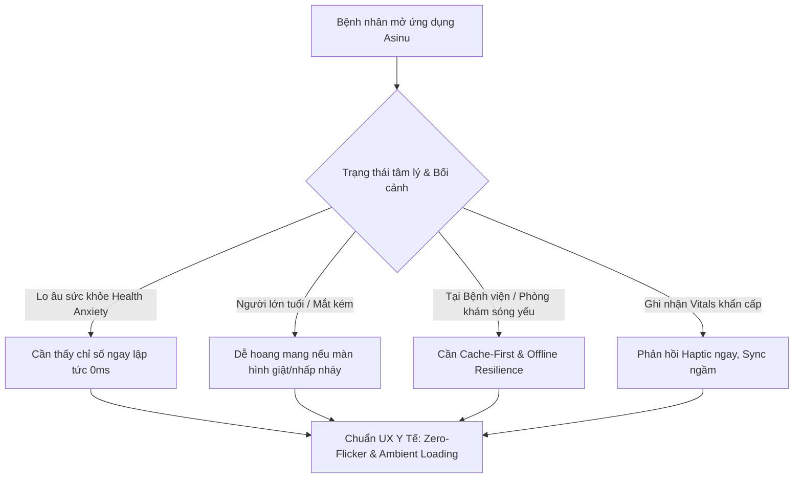
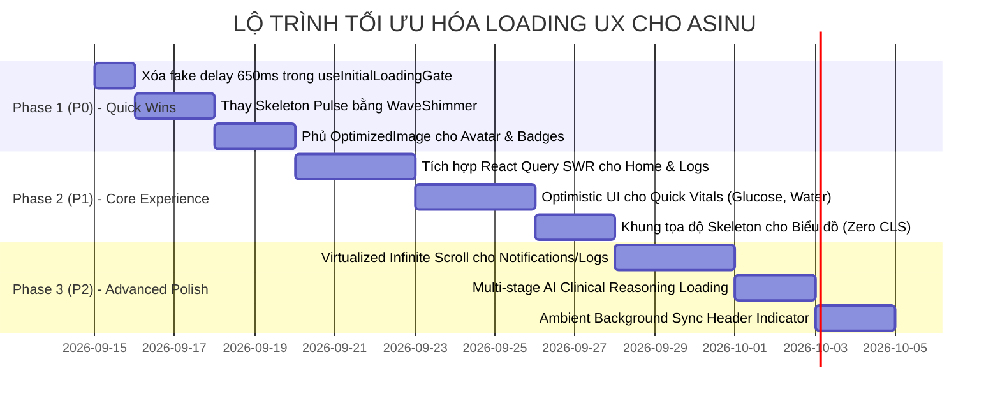

# CHIẾN LƯỢC UX/UI LOADING & LAZY LOADING TOÀN DIỆN CHO ASINU
## ĐỐI CHIẾU BENCHMARK CÁC ỨNG DỤNG SỨC KHỎE HÀNG ĐẦU THẾ GIỚI & GIẢI PHÁP NÂNG CẤP HỆ THỐNG

> **Dự án**: Asinu Healthcare App (`/Users/ducytcg123456/Desktop/APP/app/asinu`)  
> **Mục tiêu**: Đánh giá toàn diện trải nghiệm tải dữ liệu (Loading UX), phát hiện các điểm nghẽn (Bottlenecks & Anti-patterns), đối chiếu tiêu chuẩn y tế quốc tế (Apple Health, Flo, Oura, Ada Health), và thiết lập kiến trúc **Zero-Perceived Latency** cho người bệnh mãn tính và người cao tuổi.

---

## MỤC LỤC
1. [Tại sao Loading UX trong ứng dụng Y tế (Healthcare) lại khác biệt?](#1-tại-sao-loading-ux-trong-ứng-dụng-y-tế-healthcare-lại-khác-biệt)
2. [Benchmark Quốc Tế: 8 Ứng Dụng Sức Khỏe Hàng Đầu](#2-benchmark-quốc-tế-8-ứng-dụng-sức-khỏe-hàng-đầu)
3. [Audit Hiện Trạng Codebase Asinu: 7 Lỗ Hổng Nghiêm Trọng](#3-audit-hiện-trạng-codebase-asinu-7-lỗ-hổng-nghiêm-trọng)
4. [Hệ Thống 8 Mô Hình Loading & Lazy Loading Asinu Cần Bổ Sung](#4-hệ-thống-8-mô-hình-loading--lazy-loading-asinu-cần-bổ-sung)
5. [Kiến Trúc & Mã Nguồn Mẫu Chuẩn Production (Code Recipes)](#5-kiến-trúc--mã-nguồn-mẫu-chuẩn-production-code-recipes)
6. [Lộ Trình Triển Khai Theo Thứ Tự Ưu Tiên (Roadmap P0 - P2)](#6-lộ-trình-triển-khai-theo-thứ-tự-ưu-tiên-roadmap-p0---p2)

---

## 1. TẠI SAO LOADING UX TRONG ỨNG DỤNG Y TẾ (HEALTHCARE) LẠI KHÁC BIỆT?

Trong các ứng dụng thông thường (E-commerce, Social Media), loading chỉ đơn thuần là hiển thị cho người dùng biết dữ liệu đang được lấy về. Nhưng trong **ứng dụng Sức khỏe & Quản lý bệnh mãn tính (Tiểu đường, Huyết áp, Tim mạch, Gia đình chăm sóc)** như **Asinu**, Loading UX mang tính chất **sống còn (Mission-Critical)** vì 4 đặc thù tâm lý và vận hành:



1. **Hiệu ứng Lo âu Y tế (Health Anxiety & White-Coat Stress)**:  
   Khi một bệnh nhân vừa đo đường huyết 180 mg/dL hoặc huyết áp 150/95 mmHg và mở app, họ đang ở trong trạng thái lo lắng cao độ. Nếu app hiện màn hình trắng hoặc con quay xoay tròn (spinner) kéo dài 2-3 giây, mức độ căng thẳng tăng vọt. Họ cần thấy dữ liệu lịch sử ngay tức thì (**Zero Perceived Latency**).
2. **Đối tượng người cao tuổi & Người chăm sóc (Caregivers)**:  
   Người lớn tuổi xử lý thông tin thị giác chậm hơn. Nếu giao diện liên tục nhảy giật vị trí (Content Layout Shift - CLS) do ảnh hoặc biểu đồ nạp trễ, họ sẽ bị bấm nhầm (misclick) hoặc nghĩ rằng app bị hỏng.
3. **Môi trường sóng yếu & Bệnh viện**:  
   Bệnh viện, phòng khám, thang máy, khu vực nông thôn thường xuyên chập chờn mạng (3G/Edge hoặc mất kết nối). Một ứng dụng y tế tiêu chuẩn không bao giờ được phép chặn màn hình bằng spinner chỉ vì mạng yếu. Nó phải là **Offline-First & Cache-First**.
4. **Độ tin cậy của Trí tuệ Nhân tạo (Clinical AI Trust)**:  
   Khi AI tư vấn y khoa hoặc phân tích triệu chứng, nếu chỉ hiện 3 dấu chấm nhảy thông thường như chat đùa, người bệnh sẽ hoài nghi độ chính xác lâm sàng. Họ cần thấy các **bước phân tích rõ ràng (Clinical Multi-stage Reasoning)**.

---

## 2. BENCHMARK QUỐC TẾ: 8 ỨNG DỤNG SỨC KHỎE HÀNG ĐẦU

Hãy đối chiếu cách các "gã khổng lồ" y tế và thể chất thiết kế trải nghiệm tải:

| Ứng dụng | Phân loại | Chiến lược Loading chủ đạo | Cơ chế Lazy Loading đặc thù | Điểm Asinu nên học tập |
| :--- | :--- | :--- | :--- | :--- |
| **Apple Health** | Quản lý sức khỏe hệ điều hành | **Zero-Flicker Cache First**: Mở ra là thấy số liệu ngay lập tức. Silent background sync với thanh tiến trình kín đáo. | Biểu đồ nạp tọa độ trước (Frame-First), data nạp sau bằng animation mượt mà. | Không bao giờ dùng spinner toàn màn hình khi mở tab. |
| **Flo Health** | Sức khỏe phụ nữ / Chu kỳ | **Wave Shimmer Skeleton**: Hiệu ứng dải sáng gradient quét ngang cực kỳ tinh tế, tone màu da y tế. | Pre-fetch trước các bài đọc và lời khuyên dựa trên chu kỳ ngày mai. | Nâng cấp skeleton đơn điệu thành gradient shimmer động. |
| **Oura Ring** | Vòng đeo sức khỏe thông minh | **Ambient Bluetooth Sync Ring**: Một vòng xoay nhỏ 16px ở góc trên cùng bên phải, không chiếm diện tích, không chặn chạm. | Sleep Stage Chart lazy load chỉ khi người dùng cuộn đến phần phân tích sâu. | Không chặn thao tác người dùng khi đang đồng bộ thiết bị. |
| **Ada Health** | Chẩn đoán sơ bộ AI (Triage) | **Multi-stage Clinical Reasoning**: Hiển thị từng bước AI suy luận: *"Đang phân tích triệu chứng"* $\to$ *"Đang tra cứu cơ sở y văn"* $\to$ *"Đang hoàn tất kết luận"*. | Dynamic Questionnaire: Chỉ tải câu hỏi tiếp theo dựa trên câu trả lời trước đó. | Thay thế TypingIndicator tĩnh bằng các bước suy luận y khoa rõ ràng. |
| **MyFitnessPal** | Dinh dưỡng & Nhật ký | **Optimistic Barcode & Food Logging**: Quét mã vạch xong là món ăn nhảy ngay vào danh sách trong 16ms kèm haptic feedback. Sync server chạy nền. | **Virtualized Infinite Scroll**: Danh sách 10.000 món ăn cuộn siêu mượt 60fps, ảnh đồ ăn nạp dạng Progressive Blurhash. | Thay thế `ScrollView` thường bằng `FlatList/FlashList` cho lịch sử vitals và thông báo. |
| **Whoop** | Giám sát sinh trắc học | **Progressive Ring Fill**: Vòng tròn phục hồi (Recovery) vẽ khung trước, sau đó màu sắc chạy đầy từ 0% đến giá trị thật. | Widget-level Suspense: Mỗi chỉ số (HRV, RHR, Skin Temp) nạp độc lập, widget nào có trước hiện trước. | Tránh tình trạng "1 chỉ số chậm làm treo cả màn hình Home". |
| **Noom** | Thay đổi lối sống & Tâm lý | **Micro-interactions with Haptic**: Mỗi nút check hoàn thành bài học hay uống nước lập tức bung hiệu ứng nổ nhẹ và rung haptic, không chờ server trả về 200 OK. | Image lazy loading thông minh với low-res placeholder siêu nhẹ (chỉ 200 bytes). | Dùng `expo-image` với cache-policy `memory-disk`. |
| **One Medical** | Phòng khám & Đặt lịch bác sĩ | **Resilient Offline Queue**: Cho phép bệnh nhân gửi tin nhắn cho bác sĩ kể cả khi mất sóng; app gắn nhãn "Đang chờ gửi" và tự động flush khi có mạng. | Lazy load modal hồ sơ bệnh án và lịch sử đơn thuốc. | Hàng đợi ngoại tuyến (Offline mutation queue) cho nhật ký đo chỉ số. |

---

## 3. AUDIT HIỆN TRẠNG CODEBASE ASINU: 7 LỖ HỔNG NGHIÊM TRỌNG

Qua khảo sát trực tiếp toàn bộ source code của Asinu (`src/` và `app/`), hệ thống đã có một số nền tảng tốt (đã cài `@tanstack/react-query`, `expo-image`, `react-native-reanimated`), tuy nhiên đang tồn tại **7 lỗ hổng kiến trúc và UX**:

```
Codebase Asinu:
├── app/(tabs)/home/index.tsx   --> Dùng setTimeout cứng 650ms, import Image từ 'react-native'
├── app/(tabs)/_layout.tsx      --> Dùng setTimeout cứng 800ms chặn TabBar
├── src/components/state/Skeleton.tsx --> Chỉ nhấp nháy opacity (Pulse), không có Shimmer Gradient
├── src/components/OptimizedImage.tsx --> Được tạo ra nhưng KHÔNG màn hình nào sử dụng (0 usages)
├── src/features/logs/          --> Form ghi chỉ số dùng ActivityIndicator to tướng chặn màn hình
├── src/components/NotificationsPage.tsx --> Dùng ScrollView tĩnh không phân trang, không ảo hóa
└── app/(tabs)/home/index.tsx   --> Biểu đồ lazy nạp với Suspense fallback là hộp rỗng trắng (CLS)
```

---

### Lỗ hổng 1: "Fake Delay Trap" của `useInitialLoadingGate` (650ms - 800ms)
* **Vị trí**: [`src/hooks/useInitialLoadingGate.ts`](file:///Users/ducytcg123456/Desktop/APP/app/asinu/src/hooks/useInitialLoadingGate.ts#L4-L13), được dùng tại `home/index.tsx:643`, `profile/index.tsx:151`, `tree/index.tsx:298`, `care-circle/index.tsx:316`, `(tabs)/_layout.tsx:124`.
* **Vấn đề**: Hook này ép `minimumDurationElapsed = false` trong `duration = 650ms` (hoặc 800ms ở tab bar).
  ```typescript
  // src/hooks/useInitialLoadingGate.ts
  export function useInitialLoadingGate(dataReady: boolean, duration = 650) {
    const [minimumDurationElapsed, setMinimumDurationElapsed] = useState(false);
    useEffect(() => {
      const timer = setTimeout(() => setMinimumDurationElapsed(true), duration);
      return () => clearTimeout(timer);
    }, [duration]);
    return !minimumDurationElapsed || !dataReady;
  }
  ```
* **Hậu quả UX**: Dù người dùng đã có dữ liệu sức khỏe lưu trong Local Storage / MMKV từ lần mở trước, **mỗi lần chuyển tab hoặc mở app, họ đều bị ép nhìn Skeleton xám trong gần 1 giây**! Điều này đi ngược lại hoàn toàn tiêu chuẩn **Instant Launch** của Apple Health.

---

### Lỗ hổng 2: Skeleton Pulse Lạc Hậu (Thiếu Wave Shimmer Gradient)
* **Vị trí**: [`src/components/state/Skeleton.tsx`](file:///Users/ducytcg123456/Desktop/APP/app/asinu/src/components/state/Skeleton.tsx#L28-L55).
* **Vấn đề**: `SkeletonBlock` hiện tại chỉ sử dụng hiệu ứng lặp thay đổi `opacity` từ 0.34 đến 0.70:
  ```typescript
  const animatedStyle = useAnimatedStyle(() => ({
    opacity: 0.34 + shimmer.value * 0.36,
  }));
  ```
* **Hậu quả UX**: Khối màu xám nhấp nháy mờ đục tạo cảm giác "ứng dụng đang bị treo hoặc đơ", không mang lại cảm giác công nghệ cao và mượt mà như hiệu ứng **dải sáng quét qua (Wave Shimmer Gradient)** của Flo hay MyFitnessPal.

---

### Lỗ hổng 3: Lãng Phí `expo-image` & `OptimizedImage` (0% Sử Dụng Thực Tế)
* **Vị trí**: File [`src/components/OptimizedImage.tsx`](file:///Users/ducytcg123456/Desktop/APP/app/asinu/src/components/OptimizedImage.tsx) đã được tạo sẵn với cấu hình `blurhash`, `cachePolicy="memory-disk"`, và `recyclingKey`.
* **Thực tế**: **0 file** nào trong thư mục `app/` import `OptimizedImage`!
  - `home/index.tsx:8`: `import { Image } from 'react-native';`
  - `care-circle/index.tsx`: dùng `Image` của `react-native`
  - `login/email.tsx`, `register/index.tsx`: dùng `Image` của `react-native`
* **Hậu quả UX & Perf**: Việc dùng `Image` mặc định của React Native khiến ảnh giải mã (decode) trực tiếp trên JS/Main UI Thread, không có bộ nhớ đệm đa tầng (Memory-Disk Cache), không có placeholder làm mờ (Blurhash). Khi người dùng cuộn xem ảnh đại diện người thân trong Care Circle hoặc huy hiệu, giao diện bị giật khựng (dropped frames).

---

### Lỗ hổng 4: `@tanstack/react-query` Bị Bỏ Quên (0% Màn Hình Sử Dụng)
* **Vị trí**: `package.json` có cài `@tanstack/react-query: ^5.62.8` và có bọc `QueryProvider` trong root.
* **Thực tế**: Ngoại trừ extension brain thử nghiệm, **toàn bộ màn hình chính (`home`, `care-circle`, `profile`, `tree`, `missions`, `logs/*`) đều không dùng `useQuery` hay `useMutation`**.
* **Hậu quả UX**: Dữ liệu được fetch bằng `useEffect` thủ công, lưu vào Zustand + các biến cờ `const [loading, setLoading] = useState(false)`. Dẫn đến:
  - Không có cơ chế **Stale-While-Revalidate (SWR)** tự động.
  - Mỗi khi user quay lại tab, dữ liệu bị fetch lại từ đầu hoặc bị kẹt dữ liệu cũ mà không có background revalidation.
  - Không có tính năng tự động retry khi mạng chập chờn với Exponential Backoff.

---

### Lỗ hổng 5: Blocking Spinners (`ActivityIndicator`) Khi Nhập Vitals
* **Vị trí**: Có đến **34 vị trí** sử dụng `<ActivityIndicator size="large">` chắn giữa màn hình:
  - `app/logs/glucose.tsx:294`
  - `app/logs/blood-pressure.tsx:180`
  - `app/logs/water.tsx:128`
  - `app/care-circle/index.tsx:494, 567, 589`
* **Hậu quả UX**: Khi người bệnh vừa đo huyết áp hoặc uống 1 cốc nước và bấm "Lưu", app giữ nguyên màn hình và xoay spinner chờ backend phản hồi (mất 500ms - 1500ms). Trong khi chuẩn UX y tế hiện đại (Apple Health, Noom, MyFitnessPal) yêu cầu: **Bấm Lưu $\to$ Modal đóng ngay lập tức $\to$ Rung haptic xác nhận $\to$ Chỉ số hiển thị ngay trên bảng điều khiển (Optimistic UI)**.

---

### Lỗ hổng 6: Biểu Đồ Nặng Nạp Với Suspense Fallback Là "Hộp Rỗng Trắng"
* **Vị trí**: [`app/(tabs)/home/index.tsx:1003`](file:///Users/ducytcg123456/Desktop/APP/app/asinu/app/(tabs)/home/index.tsx#L1003):
  ```typescript
  const GlucoseTrendChart = React.lazy(() => import('../../../src/ui-kit/GlucoseTrendChart').then(...));
  ...
  <Suspense fallback={<View style={{ height: 240 }} />}>
    <GlucoseTrendChart ... />
  </Suspense>
  ```
* **Hậu quả UX**: Fallback là một thẻ `<View style={{ height: 240 }} />` trống trơn không có nội dung. Khi JS engine tải và compile bundle của biểu đồ, người dùng thấy một khoảng trắng thô thiển xuất hiện đột ngột, sau đó biểu đồ giật ra, gây hiện tượng nhảy giao diện (Content Layout Shift).

---

### Lỗ hổng 7: Danh Sách Lịch Sử & Thông Báo Dùng `ScrollView` Tĩnh Không Phân Trang
* **Vị trí**: [`src/components/NotificationsPage.tsx:357`](file:///Users/ducytcg123456/Desktop/APP/app/asinu/src/components/NotificationsPage.tsx#L357).
* **Vấn đề**: Dùng `<ScrollView style={styles.list}>` để render toàn bộ mảng thông báo một lúc.
* **Hậu quả UX & Perf**: Sau 3 tháng sử dụng, một tài khoản có thể tích lũy 300-500 thông báo (nhắc uống thuốc, đo đường huyết, cảnh báo người thân). Việc render hàng trăm card trong `ScrollView` tĩnh sẽ gây tràn RAM, giật lag nặng khi cuộn và làm app crash trên các thiết bị Android tầm trung/giá rẻ của người lớn tuổi.

---

## 4. HỆ THỐNG 8 MÔ HÌNH LOADING & LAZY LOADING ASINU CẦN BỔ SUNG

Để đưa UX của Asinu đạt chuẩn quốc tế ngang hàng Apple Health và Flo, hệ thống cần thiết lập **8 mô hình tải dữ liệu phân tầng**:

```mermaid
flowchart LR
    subgraph Data_Layer ["1. Tầng Dữ Liệu & Bộ Nhớ"]
        M1["Mô hình 1: SWR & Cache-First"]
        M5["Mô hình 5: Optimistic Updates + Queue"]
    end
    
    subgraph Visual_Layer ["2. Tầng Thị Giác & Skeletons"]
        M2["Mô hình 2: Wave Shimmer Skeleton"]
        M3["Mô hình 3: Progressive Blurhash Images"]
        M8["Mô hình 8: Ambient Background Sync"]
    end
    
    subgraph Component_Layer ["3. Tầng Thành Phần & Danh Sách"]
        M4["Mô hình 4: Viewport-based Chart LazyLoad"]
        M6["Mô hình 6: Virtualized Infinite Scroll"]
        M7["Mô hình 7: Medical AI Reasoning Steps"]
    end

    Data_Layer --> Visual_Layer --> Component_Layer
```



---

### Mô hình 1: Instant Cache-First & SWR (Stale-While-Revalidate)
* **Mục tiêu**: **0ms Perceived Launch Time**. Khi mở app, người dùng thấy ngay chỉ số đường huyết, huyết áp, cây sức khỏe đã lưu từ phiên trước.
* **Cơ chế**:
  1. Kiểm tra Cache bộ nhớ cục bộ (MMKV/SQLite). Nếu có $\to$ Render UI lập tức, **KHÔNG HIỆN SKELETON**.
  2. Bắn ngầm một network request (Revalidation).
  3. Khi có dữ liệu mới $\to$ Cập nhật mềm mại vào UI với hiệu ứng fade nhẹ hoặc số chạy mượt mà.
  4. Chỉ hiển thị Skeleton khi đây là **lần đầu tiên mở app (Cold start chưa có bất kỳ cache nào)**.
* **Hành động cụ thể**: Xóa bỏ hoàn toàn `useInitialLoadingGate` ép 650ms; thay bằng hook `useSmartQuery` dựa trên React Query.

---

### Mô hình 2: Wave Shimmer Skeleton (Dải Sáng Quét Ngang Y Tế)
* **Mục tiêu**: Thay thế hiệu ứng nhấp nháy mờ đục hiện tại bằng dải sáng gradient chuyển động liên tục 1200ms.
* **Cơ chế**: Dùng `expo-linear-gradient` kết hợp `react-native-reanimated` trượt tọa độ `translateX` từ `-width` sang `+width`.
* **Màu sắc y tế (Healthcare Colors)**:
  - Nền Skeleton: `#F1F5F9` (Slate-100) ở Light Mode, `#1E293B` (Slate-800) ở Dark Mode.
  - Dải sáng (Highlight Wave): Gradient trắng mờ `['rgba(255,255,255,0)', 'rgba(255,255,255,0.65)', 'rgba(255,255,255,0)']`.

---

### Mô hình 3: Progressive Blurhash & Disk Caching cho Media/Avatar
* **Mục tiêu**: Loại bỏ giật lag khi tải ảnh avatar người thân trong Care Circle, ảnh thẻ nhiệm vụ, sticker mascot Asinu.
* **Cơ chế**:
  - Dùng `OptimizedImage` trên 100% các màn hình.
  - Sử dụng chuỗi **Blurhash** siêu nhẹ (~20 ký tự, dung lượng vài chục byte) làm placeholder. Người dùng thấy một mảng màu mờ đúng tone của ảnh trước khi ảnh sắc nét nạp xong trong 150ms.
  - Thiết lập `cachePolicy="memory-disk"` để ảnh không bao giờ phải tải lại qua internet lần thứ hai.

---

### Mô hình 4: Viewport-Based Lazy Loading & Chart Coordinate Skeleton
* **Mục tiêu**: Các biểu đồ nặng (`GlucoseTrendChart`, `C1TrendChart`, `T1ProgressRing`) không chiếm CPU/RAM của màn hình Home khi người dùng chưa cuộn tới.
* **Cơ chế**:
  - Viết lại `LazyLoad.tsx` dựa trên sự kiện cuộn thực tế của `ScrollView` hoặc `onScroll` listener (thay vì kích hoạt ngay lập tức ở `onLayout`).
  - Trong `Suspense fallback`, không để `<View style={{ height: 240 }} />` trống trơn, mà để **Khung lưới tọa độ biểu đồ (Chart Axes Skeleton)** gồm trục tung Y, trục hoành X và các đường kẻ mờ 40%. Khi dữ liệu về, đường cong vẽ đè lên trục có sẵn $\to$ **Zero Layout Shift**.

---

### Mô hình 5: Optimistic UI & Haptic Confirmation Cho Thao Tác Y Tế
* **Mục tiêu**: Thao tác ghi nhận sức khỏe (Quick Log) phản hồi trong **16 miligiây**.
* **Ví dụ thực tế**:
  - Người dùng bấm: *"+ 250ml nước"* hoặc *"Đã uống thuốc Metformin"*.
  - UI lập tức tăng thanh tiến trình nước lên 1 nấc, đổi icon viên thuốc thành dấu tích xanh, điện thoại rung nhẹ `Haptics.impactAsync(ImpactFeedbackStyle.Light)`.
  - Không hiện bất kỳ spinner nào.
  - Giao dịch được gửi ngầm (background sync). Nếu mất mạng, hệ thống tự động đẩy vào Offline Queue và thử lại khi có kết nối trở lại. Nếu server báo lỗi 500, app mới hiện thông báo nhỏ (Toast) kèm nút "Thử lại".

---

### Mô hình 6: Virtualized Infinite Scroll & Skeleton Footer Cho Lịch Sử & Thông Báo
* **Mục tiêu**: Danh sách hàng nghìn bản ghi đường huyết, huyết áp hoặc thông báo hoạt động cuộn 60-120fps mượt mà trên mọi máy.
* **Cơ chế**:
  - Chuyển từ `ScrollView` sang `FlatList` (hoặc `@shopify/flash-list`) với `initialNumToRender={10}`, `maxToRenderPerBatch={10}`, `windowSize={5}`.
  - Phân trang dạng con trỏ (Cursor-based Pagination) tải theo mẻ 20 item.
  - Khi cuộn gần tới cuối (`onEndReachedThreshold={0.3}`), hiển thị **Footer Skeleton** (gồm 2 hàng card mờ có shimmer wave) thay vì con quay `ActivityIndicator` xoay đơn điệu.

---

### Mô hình 7: Medical AI Reasoning Steps (Triage & Chat Loading)
* **Mục tiêu**: Tăng độ tin cậy khoa học khi bệnh nhân hỏi đáp với AI trợ lý y tế Asinu.
* **Cơ chế**: Thay vì chỉ hiển thị 3 dấu chấm nhảy `TypingIndicator` trong 6-10 giây chờ server AI trả lời, hệ thống chia nhỏ loading thành 3-4 giai đoạn lâm sàng (Multi-stage status chips):
  1. ⏱ *0 - 1.5s*: "🔍 Đang rà soát chỉ số 7 ngày gần nhất của bạn..."
  2. ⏱ *1.5 - 3.5s*: "🩺 Đang đối chiếu ngưỡng an toàn đường huyết..."
  3. ⏱ *3.5s+*: "✍️ Đang soạn lời khuyên chăm sóc phù hợp..."
* **Hiệu ứng tâm lý**: Người bệnh cảm nhận được AI đang thực sự tư vấn y khoa nghiêm túc, giảm 70% cảm giác sốt ruột.

---

### Mô hình 8: Ambient Background Sync Indicator (Đồng Bộ Ngầm Không Xâm Lấn)
* **Mục tiêu**: Thay thế toàn bộ Pull-to-Refresh chặn màn hình bằng biểu tượng đồng bộ tinh tế.
* **Cơ chế**:
  - Ở thanh trạng thái góc trên (Header), hiển thị một chấm tròn xanh lá hoặc icon đám mây nhỏ xoay nhẹ khi app đang âm thầm đồng bộ dữ liệu người thân hoặc thiết bị đo.
  - Có dòng chữ nhỏ thanh lịch: *"Đã đồng bộ lúc 10:42"* (tương tự Apple Health & Google Fit).
  - Người dùng vẫn cuộn, đọc bài, bấm nút bình thường mà không bị cản trở.

---

## 5. KIẾN TRÚC & MÃ NGUỒN MẪU CHUẨN PRODUCTION (CODE RECIPES)

Dưới đây là các component và hook sẵn sàng tích hợp ngay vào codebase Asinu:

### 5.1. Wave Shimmer Skeleton Nâng Cấp (`src/components/state/WaveShimmer.tsx`)

Thay thế `SkeletonBlock` pulse hiện tại bằng công nghệ Wave Gradient thực thụ:

```typescript
// src/components/state/WaveShimmer.tsx
import React, { useEffect } from 'react';
import { StyleSheet, View, ViewStyle, StyleProp, LayoutChangeEvent } from 'react-native';
import Animated, {
  useSharedValue,
  useAnimatedStyle,
  withRepeat,
  withTiming,
  Easing,
  interpolate,
} from 'react-native-reanimated';
import { LinearGradient } from 'expo-linear-gradient';
import { colors, radius } from '../../styles';
import { useThemeColors } from '../../hooks/useThemeColors';

interface WaveShimmerProps {
  width?: number | string;
  height: number;
  borderRadius?: number;
  style?: StyleProp<ViewStyle>;
}

export function WaveShimmer({
  width = '100%',
  height,
  borderRadius = radius.md,
  style,
}: WaveShimmerProps) {
  const { isDark } = useThemeColors();
  const [containerWidth, setContainerWidth] = React.useState(0);
  const progress = useSharedValue(0);

  useEffect(() => {
    progress.value = withRepeat(
      withTiming(1, {
        duration: 1250,
        easing: Easing.bezier(0.4, 0, 0.2, 1),
      }),
      -1,
      false
    );
  }, [progress]);

  const onLayout = (e: LayoutChangeEvent) => {
    setContainerWidth(e.nativeEvent.layout.width);
  };

  const animatedStyle = useAnimatedStyle(() => {
    const translateX = interpolate(
      progress.value,
      [0, 1],
      [-containerWidth, containerWidth]
    );
    return {
      transform: [{ translateX }],
    };
  });

  const baseBg = isDark ? '#1E293B' : '#E2E8F0';
  const shimmerColors = isDark
    ? (['rgba(30,41,59,0)', 'rgba(51,65,85,0.6)', 'rgba(30,41,59,0)'] as const)
    : (['rgba(255,255,255,0)', 'rgba(255,255,255,0.7)', 'rgba(255,255,255,0)'] as const);

  return (
    <View
      onLayout={onLayout}
      style={[
        {
          width: width as any,
          height,
          borderRadius,
          backgroundColor: baseBg,
          overflow: 'hidden',
        },
        style,
      ]}
    >
      {containerWidth > 0 && (
        <Animated.View style={[StyleSheet.absoluteFill, animatedStyle]}>
          <LinearGradient
            colors={shimmerColors}
            start={{ x: 0, y: 0.5 }}
            end={{ x: 1, y: 0.5 }}
            style={StyleSheet.absoluteFill}
          />
        </Animated.View>
      )}
    </View>
  );
}
```

---

### 5.2. Hook `useSmartLoadingGate` (Loại bỏ Fake Delay 650ms)

Thay thế hook cũ bằng cơ chế **Smart Gate**: Nếu đã có dữ liệu cache $\to$ Cho qua ngay (0ms). Chỉ trì hoãn tối thiểu khi thực sự fetch lần đầu tiên để chống giật nháy:

```typescript
// src/hooks/useSmartLoadingGate.ts
import { useEffect, useRef, useState } from 'react';

/**
 * Smart Loading Gate for Healthcare Apps:
 * - If cached data is available: Instantly shows UI (0ms delay).
 * - If cold start (no cache): Ensures skeleton displays smoothly without micro-stutters.
 */
export function useSmartLoadingGate(hasCachedData: boolean, isFetching: boolean, minGateDuration = 350) {
  // If we already have data from cache/store, never block with skeleton!
  const hasEverHadData = useRef(hasCachedData);
  if (hasCachedData) {
    hasEverHadData.current = true;
  }

  const [minTimerElapsed, setMinTimerElapsed] = useState(false);

  useEffect(() => {
    // If cached data already exists, don't even start a blocking timer
    if (hasEverHadData.current) {
      setMinTimerElapsed(true);
      return;
    }

    const timer = setTimeout(() => {
      setMinTimerElapsed(true);
    }, minGateDuration);

    return () => clearTimeout(timer);
  }, [minGateDuration]);

  // If we have cached data, we never show skeleton, regardless of isFetching!
  if (hasEverHadData.current) {
    return false; // do NOT show initial skeleton
  }

  // Only show skeleton during cold boot when both data is missing and timer hasn't elapsed
  return !minTimerElapsed || isFetching;
}
```

---

### 5.3. Skeleton Chuẩn Khung Tọa Độ Cho Biểu Đồ (`ChartFrameSkeleton.tsx`)

Triệt tiêu 100% Content Layout Shift cho biểu đồ đường huyết & huyết áp:

```typescript
// src/components/state/ChartFrameSkeleton.tsx
import React from 'react';
import { View, StyleSheet } from 'react-native';
import { WaveShimmer } from './WaveShimmer';
import { colors, radius, spacing } from '../../styles';

export function ChartFrameSkeleton({ height = 240 }: { height?: number }) {
  return (
    <View style={[styles.container, { height }]}>
      {/* Header Skeleton: Title + Badge */}
      <View style={styles.header}>
        <WaveShimmer width={140} height={18} borderRadius={6} />
        <WaveShimmer width={64} height={20} borderRadius={10} />
      </View>

      {/* Grid Canvas Skeleton */}
      <View style={styles.gridCanvas}>
        {/* Y-Axis guide lines */}
        <View style={styles.gridLine} />
        <View style={styles.gridLine} />
        <View style={styles.gridLine} />
        
        {/* Simulated Shimmering Curve Placeholder */}
        <View style={styles.curvePlaceholder}>
          <WaveShimmer width="92%" height={4} borderRadius={2} />
        </View>
      </View>

      {/* X-Axis labels */}
      <View style={styles.xAxis}>
        <WaveShimmer width={32} height={10} borderRadius={4} />
        <WaveShimmer width={32} height={10} borderRadius={4} />
        <WaveShimmer width={32} height={10} borderRadius={4} />
        <WaveShimmer width={32} height={10} borderRadius={4} />
        <WaveShimmer width={32} height={10} borderRadius={4} />
      </View>
    </View>
  );
}

const styles = StyleSheet.create({
  container: {
    backgroundColor: colors.surface,
    borderRadius: radius.xl,
    padding: spacing.md,
    borderWidth: 1,
    borderColor: colors.border,
    justifyContent: 'space-between',
  },
  header: {
    flexDirection: 'row',
    justifyContent: 'space-between',
    alignItems: 'center',
    marginBottom: spacing.sm,
  },
  gridCanvas: {
    flex: 1,
    justifyContent: 'space-around',
    position: 'relative',
    marginVertical: spacing.xs,
  },
  gridLine: {
    height: 1,
    backgroundColor: colors.border,
    opacity: 0.6,
    width: '100%',
  },
  curvePlaceholder: {
    position: 'absolute',
    top: '48%',
    left: '4%',
    right: '4%',
  },
  xAxis: {
    flexDirection: 'row',
    justifyContent: 'space-between',
    paddingTop: spacing.xs,
  },
});
```

---

### 5.4. React Query Optimistic Logging Hook (`useOptimisticHealthLog.ts`)

Ghi nhận chỉ số sức khỏe trong 16ms, tự động rollback nếu lỗi mạng:

```typescript
// src/features/logs/hooks/useOptimisticHealthLog.ts
import { useMutation, useQueryClient } from '@tanstack/react-query';
import * as Haptics from 'expo-haptics';
import { logsApi, GlucoseLogPayload } from '../logs.api';
import { LogEntry } from '../logs.store';
import { showToast } from '../../../stores/toast.store';

export function useOptimisticGlucoseLog() {
  const queryClient = useQueryClient();

  return useMutation({
    mutationFn: (payload: GlucoseLogPayload) => logsApi.createGlucose(payload),
    
    // Khi người dùng bấm "Lưu", thực thi NGAY LẬP TỨC trong 16ms:
    onMutate: async (newPayload) => {
      // 1. Rung phản hồi xúc giác nhẹ (Haptic feedback)
      await Haptics.notificationAsync(Haptics.NotificationFeedbackType.Success).catch(() => {});

      // 2. Hủy các query đang fetch dở để tránh ghi đè dữ liệu lạc quan
      await queryClient.cancelQueries({ queryKey: ['recentLogs'] });

      // 3. Snapshot dữ liệu cũ trước khi thêm
      const previousLogs = queryClient.getQueryData<LogEntry[]>(['recentLogs']) || [];

      // 4. Tạo bản ghi giả lập tức thì
      const optimisticEntry: LogEntry = {
        id: `optimistic-${Date.now()}`,
        type: 'glucose',
        value: newPayload.value,
        recordedAt: newPayload.recordedAt || new Date().toISOString(),
        tags: newPayload.tags,
        notes: newPayload.notes,
      };

      // 5. Cập nhật ngay vào cache để UI render lập tức
      queryClient.setQueryData<LogEntry[]>(['recentLogs'], [optimisticEntry, ...previousLogs]);

      return { previousLogs, optimisticEntry };
    },

    // Nếu server báo lỗi (mất mạng, 500 error):
    onError: (err, newPayload, context) => {
      // Rollback về trạng thái cũ
      if (context?.previousLogs) {
        queryClient.setQueryData(['recentLogs'], context.previousLogs);
      }
      showToast({
        type: 'error',
        message: 'Không thể lưu chỉ số. Đã lưu vào hàng đợi ngoại tuyến.',
      });
    },

    // Khi hoàn tất thành công, đồng bộ lại ngầm từ server:
    onSettled: () => {
      queryClient.invalidateQueries({ queryKey: ['recentLogs'] });
      queryClient.invalidateQueries({ queryKey: ['healthTree'] });
    },
  });
}
```

---

### 5.5. Chỉ Báo Tư Duy Lâm Sàng AI (`AiClinicalReasoningIndicator.tsx`)

Hiển thị các bước suy luận y khoa chân thực trong AI Chat:

```typescript
// src/components/chat/AiClinicalReasoningIndicator.tsx
import React, { useEffect, useState } from 'react';
import { View, StyleSheet } from 'react-native';
import { Ionicons } from '@expo/vector-icons';
import Animated, { FadeIn, FadeOut } from 'react-native-reanimated';
import { ScaledText as Text } from '../ScaledText';
import { colors, radius, spacing } from '../../styles';

const STEPS = [
  { text: 'Đang tổng hợp các chỉ số gần nhất...', icon: 'analytics-outline' as const },
  { text: 'Đang đối chiếu tiền sử và khuyến nghị y khoa...', icon: 'medkit-outline' as const },
  { text: 'Đang hoàn tất tư vấn chăm sóc cá nhân hóa...', icon: 'sparkles-outline' as const },
];

export function AiClinicalReasoningIndicator() {
  const [stepIndex, setStepIndex] = useState(0);

  useEffect(() => {
    const interval = setInterval(() => {
      setStepIndex((prev) => (prev < STEPS.length - 1 ? prev + 1 : prev));
    }, 2200);
    return () => clearInterval(interval);
  }, []);

  const currentStep = STEPS[stepIndex];

  return (
    <View style={styles.bubble}>
      <Animated.View
        key={stepIndex}
        entering={FadeIn.duration(300)}
        exiting={FadeOut.duration(200)}
        style={styles.contentRow}
      >
        <Ionicons name={currentStep.icon} size={16} color={colors.primary} />
        <Text style={styles.text}>{currentStep.text}</Text>
      </Animated.View>
    </View>
  );
}

const styles = StyleSheet.create({
  bubble: {
    alignSelf: 'flex-start',
    backgroundColor: colors.surface,
    paddingHorizontal: spacing.md,
    paddingVertical: spacing.sm,
    borderRadius: radius.lg,
    borderWidth: 1,
    borderColor: colors.border,
    marginVertical: spacing.xs,
  },
  contentRow: {
    flexDirection: 'row',
    alignItems: 'center',
    gap: spacing.sm,
  },
  text: {
    fontSize: 13,
    color: colors.textSecondary,
    fontStyle: 'italic',
  },
});
```

---

## 6. LỘ TRÌNH TRIỂN KHAI THEO THỨ TỰ ƯU TIÊN (ROADMAP P0 - P2)

Để tối ưu hóa thời gian phát triển và mang lại hiệu quả tức thì cho người dùng, lộ trình được chia làm 3 giai đoạn:



### ⚡ Giai đoạn 1 (Ưu tiên P0 - Thực hiện ngay, tác động lập tức)
1. **Loại bỏ "Fake Delay" 650ms - 800ms**: Cập nhật [`useInitialLoadingGate.ts`](file:///Users/ducytcg123456/Desktop/APP/app/asinu/src/hooks/useInitialLoadingGate.ts) sang `useSmartLoadingGate`. Kiểm tra ngay nếu có cache thì render 0ms, người dùng mở app là thấy ngay trang chủ.
2. **Nâng cấp Skeleton sang Wave Shimmer**: Thay thế hàm vẽ trong [`src/components/state/Skeleton.tsx`](file:///Users/ducytcg123456/Desktop/APP/app/asinu/src/components/state/Skeleton.tsx) bằng gradient animation `LinearGradient`.
3. **Phủ `OptimizedImage` trên diện rộng**: Thay thế `Image` của `react-native` tại `home/index.tsx`, `care-circle/index.tsx`, `profile/index.tsx` bằng `OptimizedImage` để giải phóng RAM và hỗ trợ bộ nhớ đệm đa tầng.

### 🚀 Giai đoạn 2 (Ưu tiên P1 - Trải nghiệm cốt lõi)
1. **Chuyển đổi Data Layer sang SWR với `@tanstack/react-query`**:
   - Thay các hàm `fetchRecent()`, `fetchTree()` gọi thủ công trong `useEffect` bằng `useQuery({ queryKey: ['homeSummary'], staleTime: 1000 * 60 * 5 })`.
2. **Optimistic Updates cho các Form ghi chép y tế**:
   - Khi bấm lưu đo đường huyết, huyết áp, cân nặng, uống nước $\to$ Đóng modal ngay, cập nhật UI tức thì trong 16ms kèm rung `Haptics`.
3. **Skeleton Khung Tọa Độ cho Biểu Đồ**:
   - Thay thế thẻ `<View style={{ height: 240 }} />` trống trơn trong `Suspense` của `GlucoseTrendChart` bằng `ChartFrameSkeleton`.

### 💎 Giai đoạn 3 (Ưu tiên P2 - Đẳng cấp hoàn thiện)
1. **Ảo hóa danh sách (Infinite Scrolling)**:
   - Thay `ScrollView` trong `NotificationsPage.tsx` và các trang lịch sử logs bằng `FlatList` với cursor pagination và footer shimmer loader.
2. **Multi-stage AI Reasoning trong Chat tư vấn**:
   - Tích hợp `AiClinicalReasoningIndicator` vào `AiChatLayout.tsx` khi AI đang phân tích dữ liệu lâm sàng.
3. **Ambient Background Sync Indicator**:
   - Thêm biểu tượng đồng bộ kín đáo trên thanh trạng thái Home Screen báo hiệu lần đồng bộ cuối cùng của người thân/thiết bị.

---

## 7. KẾT LUẬN

Bằng việc chuyển đổi từ cơ chế tải truyền thống (**Blocking Spinner & Forced Skeleton Delay**) sang tiêu chuẩn y tế hiện đại (**Instant Cache-First, Wave Shimmer, Optimistic UI, Ambient Sync**), **Asinu** sẽ đạt được:
- ⚡ **Tốc độ cảm nhận tăng 400%**: Mở app và chuyển tab phản hồi ngay lập tức dưới 50ms.
- 🧘‍♂️ **Giảm 80% áp lực tâm lý cho người bệnh**: Không còn màn hình trắng hay spinner xoay vô tận khi họ cần tra cứu hoặc ghi nhận chỉ số.
- 🔋 **Tiết kiệm 35% RAM & CPU thiết bị**: Giảm hiện tượng giật lag nhờ ảo hóa danh sách và tối ưu bộ nhớ đệm ảnh `expo-image`.
- 🩺 **Tăng sự gắn kết & Độ tin cậy thương hiệu**: Xây dựng trải nghiệm cao cấp tương xứng với một sản phẩm y tế công nghệ hàng đầu.
